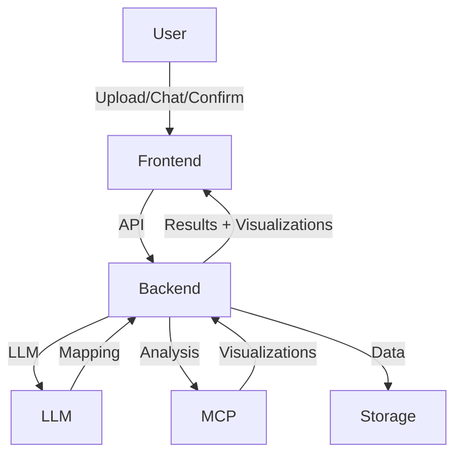
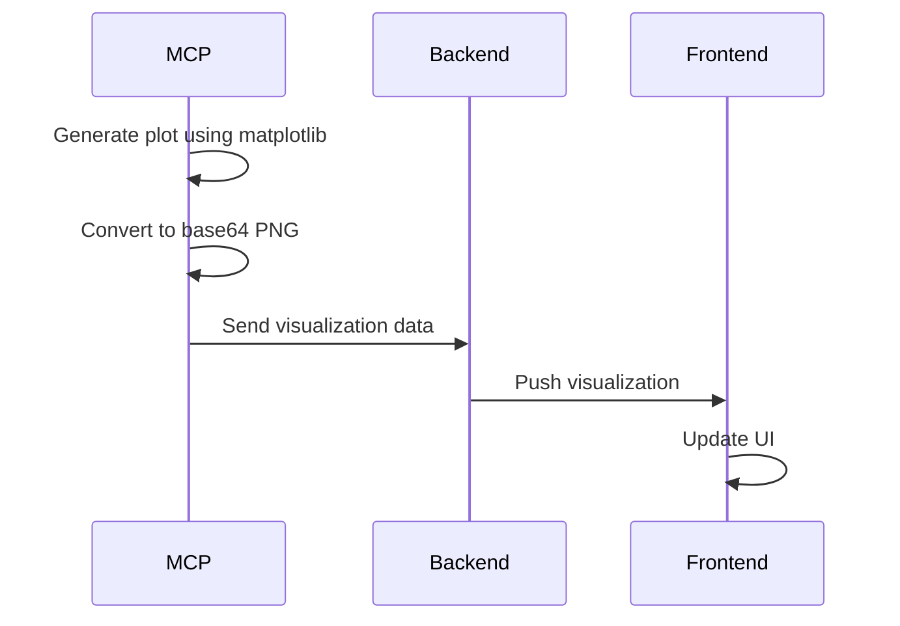
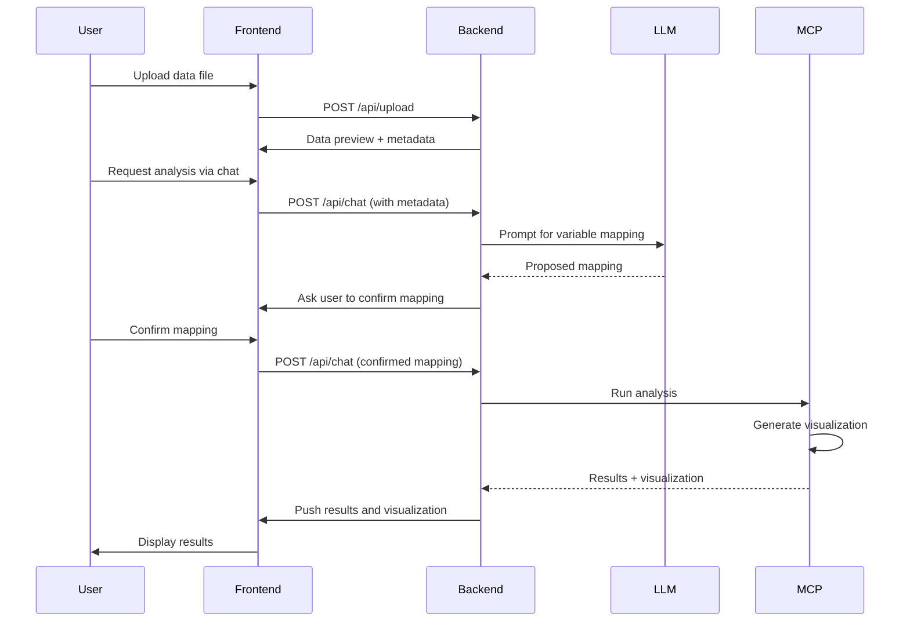

# AI Market Research Platform Architecture

---

## Overview
This platform enables users to upload market research data (SPSS, CSV, Excel), preview and confirm variable mappings (powered by LLM/Deepseek), and run advanced analyses (e.g., Van Westendorp) with interactive chat and visualization. The architecture is modular, scalable, and designed for explainability and extensibility.

---

## High-Level Architecture

---

## Components

### 1. Frontend (Next.js)
- **File Upload:** Supports SPSS, CSV, Excel. Sends data to backend.
- **Data Preview:** Shows preview and metadata after upload.
- **Chat Interface:** User requests analysis, confirms variable mapping, and receives results.
- **Interactive Results:** Displays charts, tables, and insights.
- **Real-time Visualization:** Updates visualizations as they are pushed from MCPs.

### 2. Backend (FastAPI)
- **API Layer:** Handles file upload, analysis requests, and chat.
- **Data Loader:** Loads data and extracts metadata (esp. for SPSS).
- **Agent Controller:** Orchestrates analysis requests, LLM prompts, and MCP server calls.
- **LLM Integration:** Uses Deepseek (or other LLM) to interpret variable descriptions and propose mappings.
- **MCP Servers:** Modular analysis engines that:
    - Use LLM-proposed variable mapping
    - Ask user for confirmation if needed
    - Run analysis and generate visualizations
    - Push visualizations to frontend
    - Currently implemented:
        - VanWestendorpMCP: Price sensitivity analysis
            - Calculates PMC, PME, and OPP
            - Generates price sensitivity curves using matplotlib
            - Converts plots to base64-encoded PNG
            - Provides detailed insights
            - Handles data validation and filtering
            - Supports interactive visualization

### 3. Data Flow
1. **Upload:** User uploads data file → Backend extracts data + metadata
2. **Preview:** Frontend displays preview and metadata
3. **Analysis Request:** User requests analysis via chat
4. **LLM Variable Mapping:** Backend uses LLM to propose variable mapping
5. **User Confirmation:** User confirms/edits mapping via chat
6. **Analysis Execution:** MCP server runs analysis with confirmed mapping
7. **Visualization Generation:** MCP generates plots using matplotlib
8. **Results Push:** MCP sends visualizations and results to frontend
9. **Display:** Frontend updates UI with new visualizations

---

## Visualization Pipeline

1. **Generation:** MCP creates visualization using matplotlib
2. **Conversion:** Plot is converted to base64-encoded PNG
3. **Transmission:** Visualization data is sent to frontend
4. **Display:** Frontend renders visualization in real-time
5. **Interaction:** User can interact with visualization (zoom, pan, export)

---

## Key Design Principles
- **Modularity:** Each analysis type is a separate MCP server; easy to add new analyses.
- **Explainability:** LLM explains variable mapping and analysis steps to the user.
- **Interactivity:** User confirms variable mapping before analysis runs.
- **Extensibility:** Supports new file types, LLMs, and analysis modules.
- **Data Quality:** Robust validation and filtering of input data.
- **Performance:** Efficient processing of large datasets.
- **Visualization:** Real-time updates and interactive features.

---

## Example Sequence
1. **User uploads SPSS file** → Backend extracts data and metadata
2. **User requests "Van Westendorp analysis"**
3. **Agent Controller**:
    - Uses LLM to map variables from metadata
    - Proposes mapping to user via chat
    - Waits for user confirmation
4. **User confirms mapping**
5. **VanWestendorpMCP**:
    - Validates input data
    - Filters for complete responses
    - Calculates price points (PMC, PME, OPP)
    - Generates sensitivity curves using matplotlib
    - Converts plots to base64 PNG
    - Returns results with visualizations
6. **Frontend displays results** (charts, tables, insights)

---

## Technologies Used
- **Frontend:** Next.js, React, Tailwind CSS
- **Backend:** FastAPI, Pydantic, Uvicorn
- **AI/LLM:** Deepseek (or pluggable LLM)
- **Data Analysis:** Pandas, Numpy
- **Visualization:** Matplotlib
- **File Support:** SPSS (pyreadstat), CSV, Excel

---

## Extending the Platform
- **Add new MCP:** Create a new MCP class in `backend/app/mcp/` and register it.
- **Add new analysis type:** Update LLM prompt and frontend options.
- **Swap LLM:** Replace Deepseek integration in Agent Controller.
- **Add visualization:** Implement matplotlib plotting in MCP.

---

## Diagram: Data & Control Flow

---

## License
MIT 