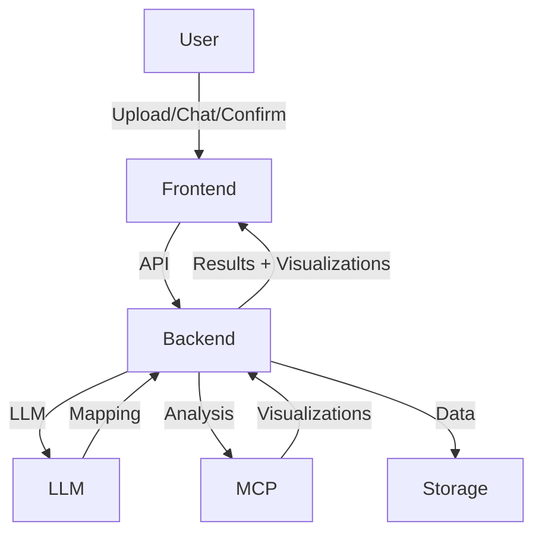
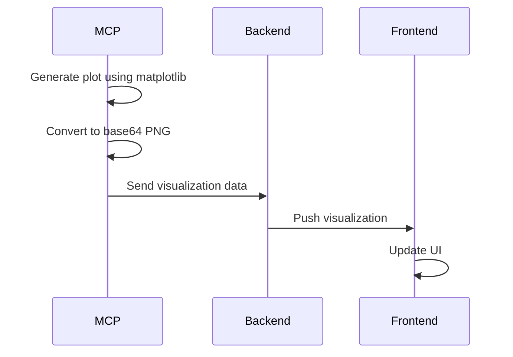
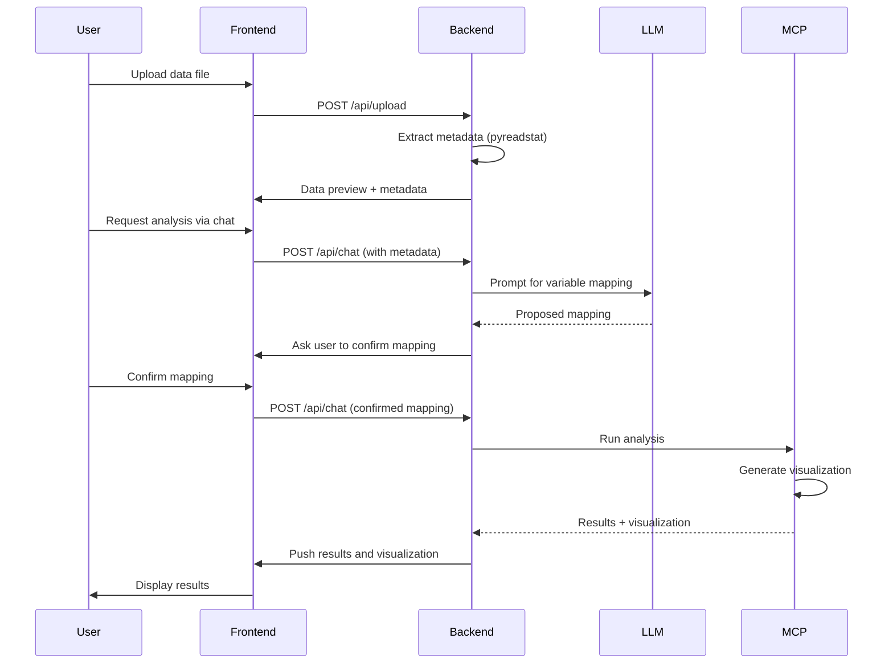

# AI Market Research Platform Architecture

---

## Overview
This platform enables users to upload market research data (SPSS, CSV, Excel), preview and confirm variable mappings (powered by LLM/Deepseek), and run advanced analyses (e.g., Van Westendorp) with interactive chat and visualization. The architecture is modular, scalable, and designed for explainability and extensibility.

---

## High-Level Architecture

---

## Components

### 1. Frontend (Next.js)
- **File Upload:** Supports SPSS, CSV, Excel. Sends data to backend.
- **Data Preview:** Shows preview and metadata after upload.
- **Chat Interface:** User requests analysis, confirms variable mapping, and receives results.
- **Interactive Results:** Displays charts, tables, and insights.
- **Real-time Visualization:** Updates visualizations as they are pushed from MCPs.
- **Multi-Segment Chart Carousel:**
    - When an analysis (e.g., Van Westendorp) is segmented (e.g., by age group), the frontend displays all resulting charts in a modern carousel/slider UI.
    - Users can navigate between charts using left/right arrows, dot indicators, or keyboard arrow keys.
    - The chart area is vertically and horizontally centered, with improved padding and spacing for clarity.
    - Download/export buttons are clearly aligned below the chart.
    - Chart titles and segment labels are always visible and not cut off.
    - The UI adapts to any number of segments (e.g., 4-5 age groups) and provides a seamless experience for multi-segment analysis.

### 2. Backend (FastAPI)
- **API Layer:** Handles file upload, analysis requests, and chat.
- **Data Loader:** Loads data and extracts comprehensive metadata (esp. for SPSS using pyreadstat).
- **Agent Controller:** Orchestrates analysis requests, LLM prompts, and MCP server calls.
- **LLM Integration:** Uses Deepseek (or other LLM) to interpret variable descriptions and propose mappings.
- **MCP Servers:** Modular analysis engines that:
    - Use LLM-proposed variable mapping
    - Ask user for confirmation if needed
    - Run analysis and generate visualizations
    - Push visualizations to frontend
    - Currently implemented:
        - VanWestendorpMCP: Price sensitivity analysis
            - Calculates key price points:
                - PMC: Intersection of Too Cheap and Getting Expensive curves
                - PME: Intersection of Bargain and Too Expensive curves
                - OPP: Intersection of Too Cheap and Too Expensive curves
            - Generates accurate price sensitivity curves using proper cumulative distributions
            - Converts plots to base64-encoded PNG with precise price point markers
            - Provides detailed insights and recommendations
            - Handles data validation and preprocessing:
                - Sorts price arrays for proper cumulative calculation
                - Validates respondent data completeness
                - Ensures correct curve orientations
            - Calculates price sensitivity: (PME - PMC) / PMC * 100
            - Supports interactive visualization with accurate price point markers
            - Enhanced segmentation support:
                - Automatically identifies segmentation variables from metadata
                - Uses LLM to match variable names with questions
                - Runs analysis separately for each segment
                - Provides segment-specific insights and visualizations

### 3. Data Flow
1. **Upload:** User uploads data file → Backend extracts data + metadata
2. **Preview:** Frontend displays preview and metadata
3. **Analysis Request:** User requests analysis via chat
4. **LLM Variable Mapping:** Backend uses LLM to propose variable mapping
5. **User Confirmation:** User confirms/edits mapping via chat
6. **Analysis Execution:** MCP server runs analysis with confirmed mapping
7. **Visualization Generation:** MCP generates plots using matplotlib
8. **Results Push:** MCP sends visualizations and results to frontend
9. **Display:** Frontend updates UI with new visualizations

---

## Metadata Handling

### SPSS Metadata Extraction
The system uses `pyreadstat` to extract comprehensive metadata from SPSS files:

- **Column Names:** Variable names from the dataset
- **Column Labels:** Full question text for each variable
- **Value Labels:** Response options and their corresponding values
- **Variable Labels:** Additional variable descriptions
- **Variable Formats:** Data format information
- **Variable Measures:** Measurement levels (nominal, ordinal, scale)
- **Variable Roles:** SPSS variable roles
- **Variable Values:** Additional value information

### Metadata Caching
- **5-minute cache:** Reduces redundant parsing of large SPSS files
- **Automatic regeneration:** Detects corrupted or empty metadata and regenerates
- **Error recovery:** Graceful handling of file access issues

### Variable Mapping
- **LLM-powered matching:** Uses Deepseek to match user requests with available variables
- **Semantic matching:** Considers question text, variable labels, and value labels
- **Segmentation support:** Automatically identifies age, gender, income, and other segmentation variables

---

## Visualization Pipeline

1. **Generation:** MCP creates visualization using matplotlib
2. **Conversion:** Plot is converted to base64-encoded PNG
3. **Transmission:** Visualization data is sent to frontend
4. **Display:** Frontend renders visualization in real-time
5. **Interaction:** User can interact with visualization (zoom, pan, export, carousel navigation for multi-segment results)

---

## Key Design Principles
- **Modularity:** Each analysis type is a separate MCP server; easy to add new analyses.
- **Explainability:** LLM explains variable mapping and analysis steps to the user.
- **Interactivity:** User confirms or edits variable mapping in chat before analysis runs. The backend never leaves the MCP context until mapping is confirmed. Users can confirm with 'yes'/'confirm' or provide a new mapping in natural language.
- **Extensibility:** Supports new file types, LLMs, and analysis modules.
- **Data Quality:** Robust validation and filtering of input data.
- **Performance:** Efficient processing of large datasets with metadata caching.
- **Visualization:** Real-time updates and interactive features, including carousel for segmented results.
- **Segmentation:** Automatic identification and handling of segmentation variables, with multi-segment visualization in the frontend.

---

## Example Sequence
1. **User uploads SPSS file** → Backend extracts data and comprehensive metadata
2. **User requests "Van Westendorp analysis by age"**
3. **Agent Controller**:
    - Uses LLM to identify age variable from metadata
    - Maps Van Westendorp variables using LLM
    - Proposes mapping to user via chat
    - Waits for user confirmation
4. **User confirms mapping**
5. **VanWestendorpMCP**:
    - Identifies age groups from value labels
    - Runs analysis separately for each age group
    - Validates input data for each segment
    - Filters for complete responses
    - Calculates price points (PMC, PME, OPP) for each segment
    - Generates sensitivity curves using matplotlib
    - Converts plots to base64 PNG
    - Returns results with segment-specific visualizations
6. **Frontend displays results** (charts, tables, insights) for each age group, with a carousel/slider for charts

---

## Technologies Used
- **Frontend:** Next.js, React, Tailwind CSS
- **Backend:** FastAPI, Pydantic, Uvicorn
- **AI/LLM:** Deepseek (or pluggable LLM)
- **Data Analysis:** Pandas, Numpy
- **Visualization:** Matplotlib
- **File Support:** SPSS (pyreadstat), CSV, Excel
- **Metadata:** Comprehensive SPSS metadata extraction and caching

---

## Extending the Platform
- **Add new MCP:** Create a new MCP class in `backend/app/mcp/` and register it.
- **Add new analysis type:** Update LLM prompt and frontend options.
- **Swap LLM:** Replace Deepseek integration in Agent Controller.
- **Add visualization:** Implement matplotlib plotting in MCP.
- **Add segmentation:** Implement automatic variable identification and segment-specific analysis.

---

## Diagram: Data & Control Flow

---

## License
MIT 